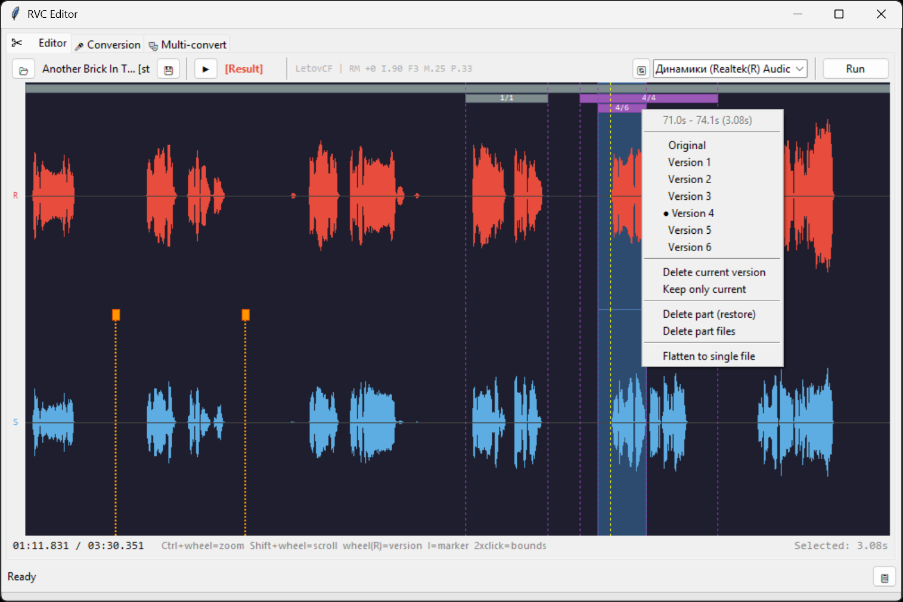
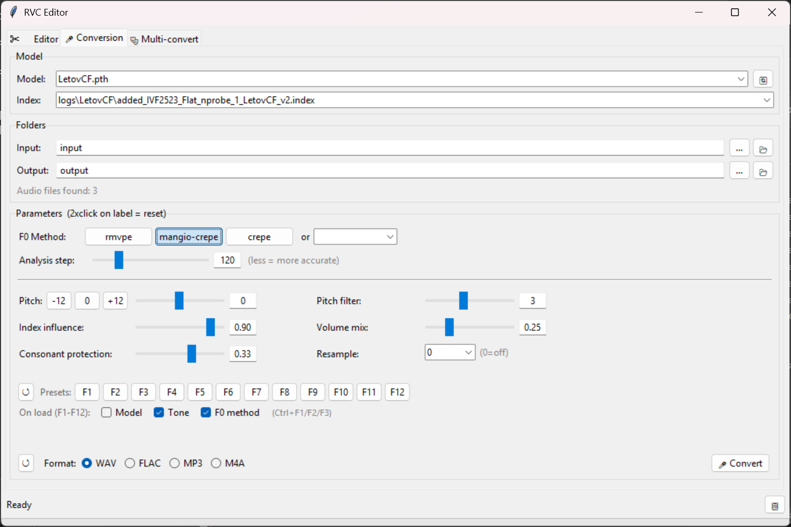

# RVC Editor

A standalone GUI application for voice conversion using RVC v2 models. Built on top of [RVC WebUI](https://github.com/RVC-Project/Retrieval-based-Voice-Conversion-WebUI) with added features for efficient audio editing and batch processing.

## Features

- **Waveform Editor** — Real-time audio editing with source/result comparison
- **Version Control** — Non-destructive editing with multiple conversion versions per segment
- **Markers System** — Split audio into segments for selective conversion
- **Batch Conversion** — Process entire folders with consistent settings
- **Multi-Convert** — Apply multiple parameter presets to the same files
- **12 Quick Presets** — Save and load complete configurations with F1-F12
- **Mangio-Crepe Support** — Added F0 method with configurable hop_length
- **Multi-language** — English, Russian, Chinese (auto-detected)

## Screenshots





## Requirements

- **Base**: [RVC20240604Nvidia.7z](https://huggingface.co/lj1995/VoiceConversionWebUI/tree/main) (or compatible RVC v2 build)
- **Trained Models**: `.pth` files in `assets/weights/`
- **Index Files**: `.index` files in `logs/` subfolders
- **FFmpeg**: Required for MP3/M4A export (place `ffmpeg.exe` in RVC root)

## Installation

1. Download and extract [RVC20240604Nvidia.7z](https://huggingface.co/lj1995/VoiceConversionWebUI/tree/main)
2. Clone or download this repository
3. Copy the `app` folder into your RVC root directory:
```
app/
├── main.py           # Entry point, mangio-crepe patcher
├── gui.py            # Main window, tabs, preset system
├── editor.py         # Waveform editor, part groups, playback
├── converter.py      # RVC wrapper, audio processing
├── config_app.py     # Paths, defaults, settings I/O
├── presets.py        # F1-F12 preset management
├── widgets.py        # Custom UI components
├── lang.py           # Translations
├── mangio-crepe/     # Patched RVC files for hop_length support
│   └── on/
├── input/            # Default input folder
├── output/           # Default output folder
│   └── editor/       # Editor projects auto-save here
└── run_app.bat       # Launcher script
```
4. Run `app/run_app.bat`

> **Note**: On first launch, mangio-crepe files will be automatically patched into RVC. This adds the `mangio-crepe` F0 method with hop_length parameter support.

## Tabs Overview

### Editor Tab

Interactive waveform editor for precise vocal conversion:

| Element | Description |
|---------|-------------|
| **Source Track (S)** | Original audio waveform |
| **Result Track (R)** | Converted audio with part groups |
| **Markers** | Orange lines — segment boundaries |
| **Part Groups** | Purple/gray bars — converted segments with version history |
| **Green Line** | Playback position |
| **Yellow Line** | Cursor position |
| **Blue Area** | Current selection |

**Workflow**:
1. Load a WAV file
2. Set markers to define segments (or select regions)
3. Press `R` to convert selection (or entire file)
4. Use mouse wheel on Result track to compare versions
5. Save final result

### Conversion Tab

Standard folder-based batch conversion:

- Select model and index file
- Configure all RVC parameters
- Convert all audio files from input folder

### Multi-Convert Tab

Process files with multiple parameter combinations:

- Uses current model, pitch, and format settings
- Applies different Index Rate / Protect combinations
- Fixed parameters: F0=rmvpe, Filter=3, RMS=0.25

## Hotkeys

### Global

| Key | Action |
|-----|--------|
| `F1` - `F12` | Load preset |
| `Ctrl+F1` | Toggle "load model" on preset load |
| `Ctrl+F2` | Toggle "load pitch" on preset load |
| `Ctrl+F3` | Toggle "load F0 method" on preset load |

### Editor Tab

| Key | Action |
|-----|--------|
| `Space` | Play / Pause |
| `R` | Run conversion on selection (or entire file) |
| `I` | Add marker at cursor / Add markers at selection bounds |
| `0` - `9` | Switch to version N in part under cursor (0 = original) |
| `Ctrl + Wheel` | Zoom in/out |
| `Shift + Wheel` | Scroll horizontally |
| `Wheel` (on Result) | Switch between versions |
| `Double-click` (Source) | Select region between markers |
| `Double-click` (Result) | Select part group |
| `Right-click` | Switch track and play from position |

### Preset Buttons (Conversion Tab)

| Action | Result |
|--------|--------|
| Click preset button | **Save** current settings to that slot |
| Press F1-F12 | **Load** preset (respects toggle options) |

## Parameters

| Parameter | Range | Description |
|-----------|-------|-------------|
| **Pitch** | -24 to +24 | Semitone shift |
| **F0 Method** | rmvpe, mangio-crepe, crepe, etc. | Pitch detection algorithm |
| **Hop Length** | 16-512 | Analysis step for crepe methods (lower = more accurate, slower) |
| **Index Rate** | 0-1 | Voice timbre influence from index |
| **Protect** | 0-0.5 | Consonant protection strength |
| **Filter Radius** | 0-7 | Median filter for pitch smoothing |
| **RMS Mix** | 0-1 | Volume envelope mixing ratio |
| **Resample** | 0 / frequency | Output sample rate (0 = keep original) |

## Project Structure
```
app/
├── main.py           # Entry point, mangio-crepe patcher
├── gui.py            # Main window, tabs, preset system
├── editor.py         # Waveform editor, part groups, playback
├── converter.py      # RVC wrapper, audio processing
├── config_app.py     # Paths, defaults, settings I/O
├── presets.py        # F1-F12 preset management
├── widgets.py        # Custom UI components
├── lang.py           # Translations
├── mangio-crepe/     # Patched RVC files for hop_length support
│   └── on/
├── input/            # Default input folder
├── output/           # Default output folder
│   └── editor/       # Editor projects auto-save here
└── run_app.bat       # Launcher script
```

## Files Generated

| File | Location | Purpose |
|------|----------|---------|
| `settings.json` | `app/` | Window state, last used settings |
| `presets.json` | `app/` | Saved F1-F12 presets |
| `project.json` | `output/editor/{name}/` | Editor session (markers, parts, view state) |
| `result.wav` | `output/editor/{name}/` | Current result audio |
| `*.wav` | `output/editor/{name}/parts/` | Part group versions |

## Troubleshooting

**"Module not found" errors**  
Ensure you're running from within the RVC environment. Use `run_app.bat` which activates the correct Python.

**Model not loading**  
Check that `.pth` files are in `assets/weights/` and `.index` files are in `logs/` subfolders.

**No audio output in Editor**  
Click the refresh button (🔄) next to the audio device selector.

**FFmpeg not found**  
Place `ffmpeg.exe` in the RVC root folder for MP3/M4A export support.

## License

This project is provided as-is for personal use. RVC and its dependencies have their own licenses.

## Acknowledgments

- [RVC Project](https://github.com/RVC-Project/Retrieval-based-Voice-Conversion-WebUI) — Base voice conversion system
- [Mangio-RVC](https://github.com/Mangio621/Mangio-RVC-Fork) — Crepe hop_length implementation reference