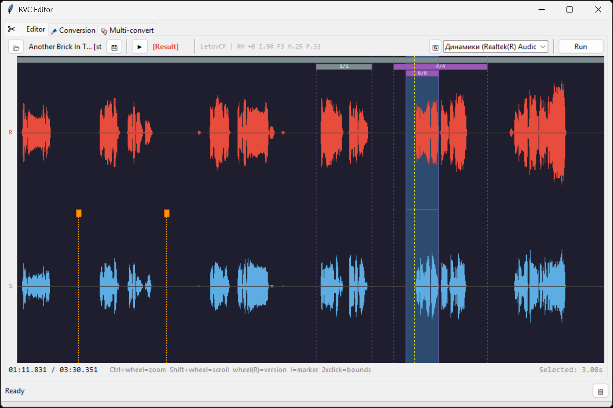

# RVC Editor

A standalone GUI application for voice conversion using RVC v2 models. Built on top of [RVC WebUI](https://github.com/RVC-Project/Retrieval-based-Voice-Conversion-WebUI) with added features for efficient audio editing, version control, and batch processing.

## Features

### Core
- **Waveform Editor** — Real-time audio editing with source/result comparison
- **Version Control** — Non-destructive editing with unlimited conversion versions per segment
- **Undo/Redo** — Full operation history with Ctrl+Z / Ctrl+Y
- **Markers System** — Split audio into segments for selective conversion
- **Blend Modes** — Crossfade on segment boundaries (0/15/30/60/120 ms)

### Batch Processing
- **Folder Conversion** — Process entire folders with consistent settings
- **Multi-Convert** — Apply multiple parameter presets to the same files
- **12 Quick Presets** — Save and load complete configurations with F1-F12

### Audio
- **Stereo Support** — Process Full/Left/Right channel separately
- **Audio Device Selection** — Choose output device for playback
- **Format Export** — WAV, FLAC, MP3, M4A output formats

### Extensions
- **Mangio-Crepe Support** — Added F0 method with configurable hop_length
- **Multi-language** — English, Russian, Chinese (auto-detected)

## Screenshots




## Requirements

- **Base**: [RVC20240604Nvidia.7z](https://huggingface.co/lj1995/VoiceConversionWebUI/tree/main) (or compatible RVC v2 build)
- **Trained Models**: `.pth` files in `assets/weights/`
- **Index Files**: `.index` files in `logs/` subfolders
- **FFmpeg**: Required for MP3/M4A export (place `ffmpeg.exe` in RVC root)

## Installation

1. Download and extract [RVC20240604Nvidia.7z](https://huggingface.co/lj1995/VoiceConversionWebUI/tree/main)
2. Clone or download this repository
3. Copy the `app` folder into your RVC root directory
4. Run `app/run_app.bat`

> **Note**: On first launch, mangio-crepe files will be automatically patched into RVC. This adds the `mangio-crepe` F0 method with hop_length parameter support.

## Tabs Overview

### Editor Tab

Interactive waveform editor for precise vocal conversion:

| Element | Description |
|---------|-------------|
| **Source Track (S)** | Original audio waveform with markers |
| **Result Track (R)** | Converted audio with part groups |
| **Markers** | Orange lines — segment boundaries (drag to move) |
| **Part Groups** | Purple/gray bars — converted segments with version history |
| **Green Line** | Playback position |
| **Yellow Line** | Cursor position |
| **Blue Area** | Current selection |

**Source Mode Button** (left of timeline):
- `F` — Full stereo mix (default)
- `L` — Left channel only
- `R` — Right channel only
- `M` — Mono (for mono files)

**Blend Buttons** (right of timeline):
- `0` — No crossfade (hard cut)
- `15` / `30` / `60` / `120` — Crossfade duration in milliseconds

**Workflow**:
1. Load a WAV file
2. Set markers to define segments (double-click selects between markers)
3. Press `R` to convert selection
4. Use mouse wheel on Result track to compare versions
5. Use number keys `0`-`9` for instant version switch + playback
6. Save final result

### Conversion Tab

Standard folder-based batch conversion:

- Select model and index file
- Configure all RVC parameters
- Convert all audio files from input folder

### Multi-Convert Tab

Process files with multiple parameter combinations:

- Uses current model, pitch, and format settings
- Applies different Index Rate / Protect / F0 combinations
- Includes mangio-crepe presets with different hop_length values

## Hotkeys

### Global

| Key | Action |
|-----|--------|
| `F1` - `F12` | Load preset |
| `Ctrl+F1` | Toggle "load model" on preset load |
| `Ctrl+F2` | Toggle "load pitch" on preset load |
| `Ctrl+F3` | Toggle "load F0 method" on preset load |

### Editor Tab — Playback & Navigation

| Key | Action |
|-----|--------|
| `Space` | Play / Pause |
| `Left/Right` | Move cursor (during playback: seek ±1s) |
| `Shift + Left/Right` | Extend selection |
| `Ctrl + Wheel` | Zoom in/out |
| `Shift + Wheel` | Scroll horizontally |

### Editor Tab — Editing

| Key | Action |
|-----|--------|
| `R` | Run conversion on selection (or entire file) |
| `I` | Add marker at cursor / Add markers at selection bounds |
| `Delete` | Delete current version (switch to previous) |
| `Ctrl+Z` | Undo |
| `Ctrl+Y` / `Ctrl+Shift+Z` | Redo |

### Editor Tab — Version Switching

| Key | Action |
|-----|--------|
| `0` | Switch to original (base) in part under cursor |
| `1` - `9` | Switch to version N and start playback |
| `Wheel` (on Result) | Switch between versions |
| `Caps Lock ON` | Replace mode — overwrite nested parts when switching |
| `Caps Lock OFF` | Preserve mode — keep nested parts intact |

### Editor Tab — Mouse

| Action | Result |
|--------|--------|
| Click | Set cursor / start selection |
| Shift + Click | Extend selection to click position |
| Double-click (Source) | Select region between markers |
| Double-click (Result) | Select part group boundaries |
| Right-click | Switch to track and play from position |
| Drag marker handle | Move marker (snaps to parts/selection) |
| Drag part edge | Resize part (snaps to markers/selection) |

### Preset Buttons (Conversion Tab)

| Action | Result |
|--------|--------|
| Click preset button | **Save** current settings to that slot |
| Press F1-F12 | **Load** preset (respects toggle options) |

## Quick Workflow

The Editor is optimized for rapid A/B comparison:

1. Load audio, select a region
2. Press `F1` → preset loads, conversion runs automatically
3. Press `1` to hear result, `0` for original
4. Press `F2` → different preset, new version added
5. Use `0`-`9` to compare: `0` = original, `1` = first, `2` = second...
6. Press `Delete` to remove bad versions
7. Save final result

**Version hotkeys (`0`-`9`)**:
- Switch to that version in the part under cursor
- Immediately start playback from cursor position
- Combines perfectly with Blend for smooth transitions

> **Tip**: Set up different models or pitches in F1-F12 presets. Workflow becomes: `F1` → `1` → `F2` → `2` → `1` → `2` → decide.

## Blend Mode

Blend creates crossfade on part boundaries to avoid clicks:

| Value | Use Case |
|-------|----------|
| `0` | Hard cuts, no blending |
| `15` | Minimal blend, preserves transients |
| `30` | Default, good for most vocals |
| `60` | Smooth transitions |
| `120` | Very smooth, may affect timing |

**How it works**:
- When switching from original to converted (or vice versa)
- Left boundary: fade from previous audio to new
- Right boundary: fade from new audio back to next segment
- Only applies when part has a base (original) saved

## Part Groups

Each converted segment becomes a Part Group:

- **Base** — Original audio (saved automatically on first convert)
- **Versions** — Each conversion adds a new version
- **Active version** — Currently applied to result

**Visual indicators**:
- Gray bar = showing base (original)
- Purple bar = showing converted version
- Brighter purple = multiple versions available
- Numbers show: current/total versions

**Operations** (right-click menu):
- Switch to any version
- Delete current version
- Keep only current (delete others)
- Delete part (restore original)
- Flatten all parts (merge to single result)

## Nested Parts

Parts can overlap or be nested inside each other:

- **Caps Lock OFF** (default): Nested parts are preserved when switching parent version
- **Caps Lock ON**: Nested parts are overwritten

This allows fine-grained control over complex edits with multiple overlapping regions.

## Undo/Redo System

Full operation history with automatic save:

**Undoable operations**:
- Convert (removes version, restores previous state)
- Switch version
- Delete version
- Delete other versions
- Delete part
- Flatten parts
- Add/remove/move markers
- Resize parts

**Storage**:
- Deleted files moved to `trash/` folder (not permanently deleted)
- Audio chunks saved for restoration
- Old trash cleaned after 48 hours

## Stereo Processing

For stereo files, choose which channel to convert:

| Mode | Description |
|------|-------------|
| `F` (Full) | Convert stereo mix (default) |
| `L` (Left) | Convert left channel only |
| `R` (Right) | Convert right channel only |

**Use case**: Isolate vocals from one channel, or process channels differently.

The source mode is saved per-version, so you can compare conversions from different channels.

## Parameters

| Parameter | Range | Description |
|-----------|-------|-------------|
| **Pitch** | -24 to +24 | Semitone shift |
| **F0 Method** | rmvpe, mangio-crepe, crepe, etc. | Pitch detection algorithm |
| **Hop Length** | 16-512 | Analysis step for crepe methods (lower = more accurate, slower) |
| **Index Rate** | 0-1 | Voice timbre influence from index |
| **Protect** | 0-0.5 | Consonant protection strength |
| **Filter Radius** | 0-7 | Median filter for pitch smoothing |
| **RMS Mix** | 0-1 | Volume envelope mixing ratio |
| **Resample** | 0 / frequency | Output sample rate (0 = keep original) |

## Project Structure

```
app/
├── main.py           # Entry point, mangio-crepe patcher
├── gui.py            # Main window, tabs, preset system
├── editor.py         # Waveform editor, part groups, playback
├── converter.py      # RVC wrapper, audio processing
├── config_app.py     # Paths, defaults, settings I/O
├── parts.py          # Part group management
├── history.py        # Undo/redo system
├── waveform.py       # Canvas rendering, mouse handling
├── presets.py        # F1-F12 preset management
├── widgets.py        # Custom UI components
├── lang.py           # Translations
├── mangio-crepe/     # Patched RVC files for hop_length support
│   └── on/
├── input/            # Default input folder
├── output/           # Default output folder
│   └── editor/       # Editor projects auto-save here
└── run_app.bat       # Launcher script
```

## Files Generated

| File | Location | Purpose |
|------|----------|---------|
| `settings.json` | `app/` | Window state, last used settings |
| `presets.json` | `app/` | Saved F1-F12 presets |
| `project.json` | `output/editor/{name}/` | Editor session (markers, parts, view state) |
| `history.json` | `output/editor/{name}/` | Undo/redo operation history |
| `result.wav` | `output/editor/{name}/` | Current result audio |
| `*.wav` | `output/editor/{name}/parts/` | Part group versions |
| `*.wav` | `output/editor/{name}/trash/` | Deleted files (for undo) |

## Troubleshooting

**"Module not found" errors**  
Ensure you're running from within the RVC environment. Use `run_app.bat` which activates the correct Python.

**Model not loading**  
Check that `.pth` files are in `assets/weights/` and `.index` files are in `logs/` subfolders.

**No audio output in Editor**  
Click the refresh button (🔄) next to the audio device selector. Try selecting a different output device.

**FFmpeg not found**  
Place `ffmpeg.exe` in the RVC root folder for MP3/M4A export support.

**Undo not working**  
Undo history is per-project. Make sure you have the same file loaded. History is saved to `history.json`.

**Clicks at segment boundaries**  
Increase Blend value (try 30 or 60 ms). This adds crossfade at transitions.

## License

This project is provided as-is for personal use. RVC and its dependencies have their own licenses.

## Acknowledgments

- [RVC Project](https://github.com/RVC-Project/Retrieval-based-Voice-Conversion-WebUI) — Base voice conversion system
- [Mangio-RVC](https://github.com/Mangio621/Mangio-RVC-Fork) — Crepe hop_length implementation reference